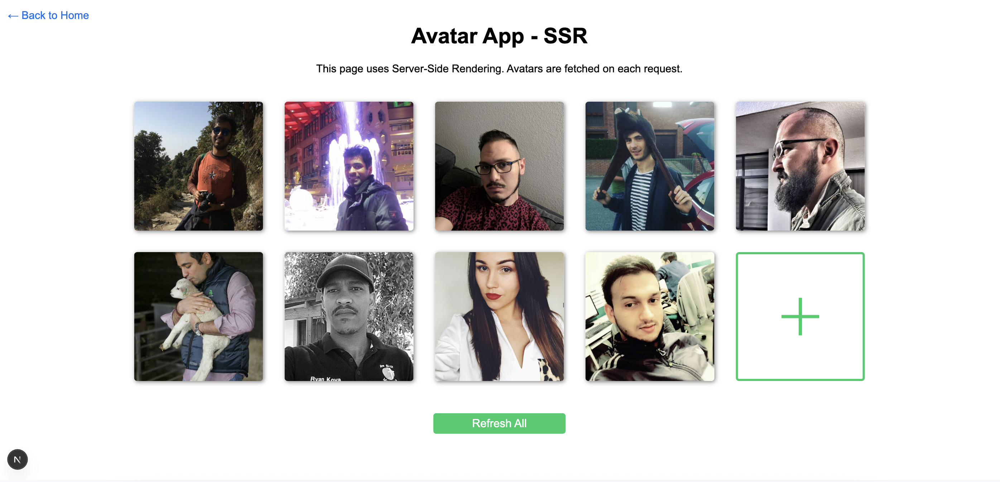

# Avatar Grid Application



## Overview

A Next.js application demonstrating different rendering strategies (SSG, SSR) with an interactive avatar grid. Users can add, refresh, and manage avatar tiles while learning about Next.js rendering methods.

## Link to deployment: 
+ https://solvd-homeworks-pop82pwhc-duard4s-projects.vercel.app/

## Features

- **Interactive Avatar Grid**:

  - Add new avatar tiles
  - Refresh individual avatars
  - Refresh all avatars at once
  - Visual loading states

- **Rendering Strategy Demos**:

  - Static Site Generation (SSG)
  - Server-Side Rendering (SSR)
  - Client-side interactivity

- **Data Management**:
  - API data fetching with caching
  - Error handling
  - Loading states

## Technologies Used

- **Framework**: Next.js 13+ (App Router)
- **Rendering**: SSG, SSR, ISR
- **State Management**: React hooks
- **Styling**: CSS Modules
- **Type Safety**: TypeScript
- **API**: Tinyfaces API

## Getting Started

### Prerequisites

- Node.js 16+
- npm/yarn/pnpm

### Installation

1. Clone the repository:

   ```bash
   git clone https://github.com/yourusername/avatar-grid-app.git
   cd avatar-grid-app
   ```

2. Install dependencies:

   ```bash
   npm install
   # or
   yarn install
   # or
   pnpm install
   ```

3. Run the development server:

   ```bash
   npm run dev
   # or
   yarn dev
   # or
   pnpm dev
   ```

4. Open [http://localhost:3000](http://localhost:3000) in your browser.

## Project Structure

```
avatar-grid-app/
├── app/
│   ├── layout.tsx        # Root layout
│   ├── page.tsx          # Home page
│   ├── ssg/
│   │   └── page.tsx      # SSG page
│   └── ssr/
│       └── page.tsx      # SSR page
├── components/
│   └── AvatarGrid.tsx    # Interactive avatar grid
├── lib/
│   └── avatarApi.ts      # API fetching utilities
├── types/
│   └── avatar.ts         # Type definitions
└── public/               # Static assets
```

## Rendering Strategies

### Static Site Generation (SSG)

- Pages pre-rendered at build time
- Fastest performance
- Good for static content
- Access via `/ssg` route

### Server-Side Rendering (SSR)

- Pages rendered on each request
- Always shows fresh data
- Good for dynamic content
- Access via `/ssr` route

## API Reference

The app uses the [Tinyfaces API](https://tinyfac.es) to fetch random avatars.

### Cache Behavior

- SSG page: Data fetched at build time
- SSR page: Data fetched on each request
- API calls cached for 1 hour (`revalidate: 3600`)

## Contributing

Contributions are welcome! Please follow these steps:

1. Fork the project
2. Create your feature branch (`git checkout -b feature/AmazingFeature`)
3. Commit your changes (`git commit -m 'Add some amazing feature'`)
4. Push to the branch (`git push origin feature/AmazingFeature`)
5. Open a Pull Request

## Acknowledgements

- [Next.js Documentation](https://nextjs.org/docs)
- [Tinyfaces API](https://tinyfac.es)
- [React Icons](https://react-icons.github.io/react-icons/)
